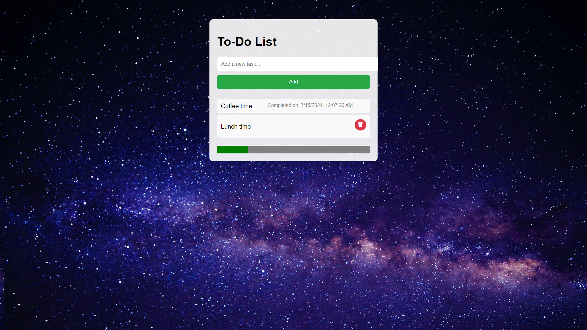

# To-Do-Web-Animated-Application



## Description

The To-Do-Web Animated Appliction is a simple, visually appealing task management application. It features a beautiful, moving galaxy background and allows users to add, delete, and track tasks with a progress bar. When a task is completed, the completion date and time are displayed next to the task name.

## Features

- **Animated Galaxy Background:** A captivating, moving galaxy serves as the background.
- **Add and Delete Tasks:** Easily add new tasks and delete completed ones.
- **Completion Timestamp:** Displays the date and time when a task is marked as completed.
- **Progress Bar:** Tracks the number of tasks completed out of a set target.
- **Responsive Design:** Works on both desktop and mobile devices.

## Demo

[Live Demo](#)

## Installation

1. Clone the repository:
    ```bash
    git clone https://github.com/SapnaMadhavai/To-Do-Web-Animated-Application.git
    ```
2. Navigate to the project directory:
    ```bash
    cd To-Do-Web-Animated-Application
    ```

## Usage

1. Open the `index.html` file in your preferred web browser:
    ```bash
    open index.html
    ```
2. Add your tasks using the input field and the "Add" button.
3. Click the red delete button to mark a task as completed and see the completion timestamp.

## File Structure

To-Do-Web-Animated-Application/
│
├── index.html # The main HTML file
├── style.css # The CSS file for styling
├── app.js # The JavaScript file for functionality
├── galaxy (1).jpg # The background image
├── README.md # The README file
└── Screenshot.png # Screenshot of the project


## Contributing

Contributions are welcome! Please open an issue or submit a pull request for any changes.

## License

This project is licensed under the MIT License.

## Acknowledgements

- Background image: [Galaxy Image](galaxy (1).png)
- Icons: [Font Awesome](https://fontawesome.com/)
- Inspiration: The vast and beautiful universe

## Contact

- **Author:** Sapna Madhavai
- **Email:** madhavaisapna@gmail.com
- **GitHub:** [SapnaMadhavai](https://github.com/SapnaMadhavai)
